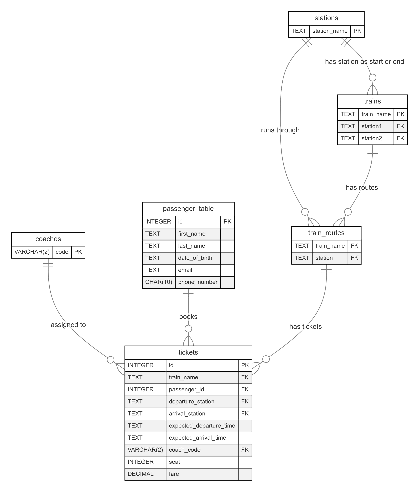

# Design Document

By Harikrishna Srinivasan

Video overview: [CS50 SQL Final Project - Railway System Database](<https://www.youtube.com/watch?v=fzC8840xFvU>)

## Railway System Database

## Scope

The purpose of the database is to facilitate the management and tracking of railway train reservations (inspired from Indian Railways).

It is designed to handle the processes of ticket booking, seat reservations, and train schedule management for passengers traveling between different stations. This includes tracking passenger information, trains, stations, coaches, and journey details.

The entities included in the database are as follows:

* Stations - The various locations where trains either start or stop.
* Coaches - Different types of train coaches (e.g., A, B, C, etc.) with their characteristics.
* Trains - Trains that run between stations.
* Train Routes - Information about the stations a particular train passes through.
* Passenger Table - Individuals traveling on the trains, with basic personal and contact details.
* Tickets - Train tickets issued to passengers, containing details about the travel journey (train name, seat, fare, etc.).

Real-time tracking, payments handling and collaborative tickets (e.g., group bookings) are out of scope of the database.

## Functional Requirements

This database will support:

* CRUD operations for stations, coaches, trains, train_routes, passenger_table and tickets.
* Passenger Management - Allows adding, editing, or deleting passenger details (including validation of email and phone numbers).
* Ticket Booking - Allows passengers to book tickets for specific trains, select their seat, and determine the fare.
* Travel Schedules - Track the expected departure and arrival times for each train and ensure that no seat is booked twice during overlapping times.
* View Booking Status - Generate reports for passengers about their ticket status, including seat availability and journey details.

In this system, real-time ticket booking or processing, integration with external systems (e.g., payment gateways, etc.), are not supported.

## Representation

Entities are captured in SQLite tables with the following schema.

### Entities and Attributes

The following tables represent the core entities of the database:

#### Stations Table

* `station_name` (TEXT): Unique name of the station. `PRIMARY KEY` constraint is applied.

#### Coaches Table

* `coach_code` (TEXT): Unique code for each coach (e.g., 'A', 'B', 'C'). This column is the `PRIMARY KEY`.

#### Trains Table

* `train_name` (TEXT): Name of the train. This column is the `PRIMARY KEY`.
* `station1` (TEXT): Departure station or arrival station. This column has `FOREIGN KEY` constraint applied referencing `station_name` column in `stations` table.
* `station2` (TEXT): Arrival station or departure station. This column has `FOREIGN KEY` constraint applied referencing `station_name` column in `stations` table.

#### Train Routes Table

* `train_name` (TEXT): Name of the train. This column has `FOREIGN KEY` constraint applied referencing `train_name` column in `trains` table.
* `station` (TEXT): The station that the train passes through. This column has `FOREIGN KEY` constraint applied referencing `station_name` column in `stations` table.

* `PRIMARY KEY` is applied to (`train_name`, `station`) as composite PRIMARY KEY.

#### Passenger Table

* `id` (INTEGER): Unique identifier for each passenger. `PRIMARY KEY` constraint applied.
* `first_name` (TEXT): First name of the passenger.
* `last_name` (TEXT): Last name of the passenger. Defaults to `NULL`.
* `date_of_birth` (TEXT): Date of birth of the passenger. (YYYY-mm-dd format ensured).
* `email` (TEXT): Email address (validated with a regex pattern). Defaults to `NULL`.
* `phone_number` (TEXT): Phone number (10 digits).

#### Tickets Table

* `id` (INTEGER): Unique identifier for the ticket. `PRIMARY KEY` constraint is applied.
* `train_name` (TEXT): Name of the train.
* `passenger_id` (INTEGER): Foreign key referring to the passenger. `FOREIGN KEY` referencing `id` in the `passenger_table`.
* `departure_station` (TEXT): Station from where the train departs.
* `arrival_station` (TEXT): Station where the train arrives.
* `expected_departure_time` (DATETIME): Expected departure time. ISO8601 format is ensured.
* `expected_arrival_time` (DATETIME): Expected arrival time. ISO8601 format is ensured.
* `coach_code` (TEXT): Code of the coach. `FOREIGN KEY` referencing `code` in the table `coaches`.
* `seat` (INTEGER): Seat number reserved for the passenger.
* `fare` (DECIMAL): Fare for the ticket. Check constraint is applied ensuring `fare` is non-negative.

* `FOREIGN KEY` constraint is applied to `passenger_id` column referencing `id` column in the `passenger_table`.
* `FOREIGN_KEY` constraint is also applied to (`train_name`, `departure_station)` as a composite foreign key referencing (`train_name`, `station`) in `train_routes` table.
* `FOREIGN_KEY` constraint is also applied to (`train_name`, `arrival_station`) as a composite foreign key referencing (`train_name`, `station`) in `train_routes` table.

#### Relationships

The below entity relationship diagram describes the relationships among the entities in the database.

As detailed by the diagram:

* A train can pass through multiple stations, but each station is passed by multiple trains.
* Each ticket is linked to one passenger, and each passenger can have multiple tickets.
* Passengers can have one or more tickets with specific details about departure, arrival, coach, and seat.

## Optimizations

#### Indexes and Views

* Index on passenger `email` for fast lookups.
* Composite index on `train_name`, `departure_station`, `arrival_station` to facilitate efficient searches on tickets, and another composite index on `train_name`, `expected_departure_time`, `expected_arrival_time` to facilitate efficient searches on tickets.
* View to show valid `passenger_tickets` with details about the train, passenger, and seat availability.

#### Triggers

* Trigger for booking conflicts - Ensures that a passenger cannot book the same seat on a train during overlapping times.
* Trigger for checking ticket expiration - Deletes expired tickets from the tickets table automatically.

## Limitations

* Real-Time Operations: This system is not designed for real-time booking or updates (e.g., it doesn't integrate with online ticketing systems). It relies on manual updates and queries for schedule and ticket management.
* Complex Queries: For more advanced analytics, such as tracking seat utilization, cross-table aggregation for large datasets, or handling multiple stops on a journey, the current schema could require additional tables and/or modifications to support complex scenarios.
